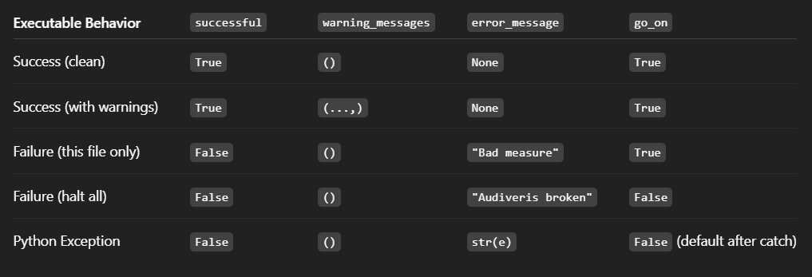

# Sightreading-AI

Generate sight-reading exercises using AI.

## Goals
- Train a transformer model to generate short melodic exercises.
   1. Collect data: pdf, mxl, musicmxl
   2. Convert to symbolic music formats: musicxml/midi
   3. Load and tokenise symbolic music formats 
   4. Train model on midi tokens
   5. Convert generated midi tokens back to sheet music formats: musicxml, PDF (or web)

- Optional: Add real-time MIDI feedback for interactive learning.

## Project Structure
1. **Data Conversion Pipeline**:
   - **PDF → MXL → MusicXML → MIDI → Tokens**: This pipeline processes input at any stage into a format suitable for model training.
   - **Generated Tokens → MIDI → ... → Sheet Music (MusicXML or PDF)**: Converts model-generated tokens back into readable sheet music.

2. **Tools and Dependencies**:
   - **Audiveris**: Used for optical music recognition to convert PDF sheet music to MusicXML.
   POTENTIALLY: - **MuseScore**: ...
   

## Quick Start
To get started with the Sightreading-AI project, follow these steps:

1. **Create a Virtual Environment**: Set up a new virtual environment to manage dependencies.
2. **Install Dependencies**: Use the `requirements.txt` file to install necessary packages.
   ```bash
   pip install -r requirements.tx
3. **Set up Pipeline**:...

## To Do
...

## Additional Information
- **ConversionOutcome Classification**: The project includes a classification system for `ConversionOutcome` objects, which is visually represented in . This classification helps in understanding the success, warnings, and errors encountered during the conversion process.
- The project includes a comprehensive logging system to track data processing and conversion stages.